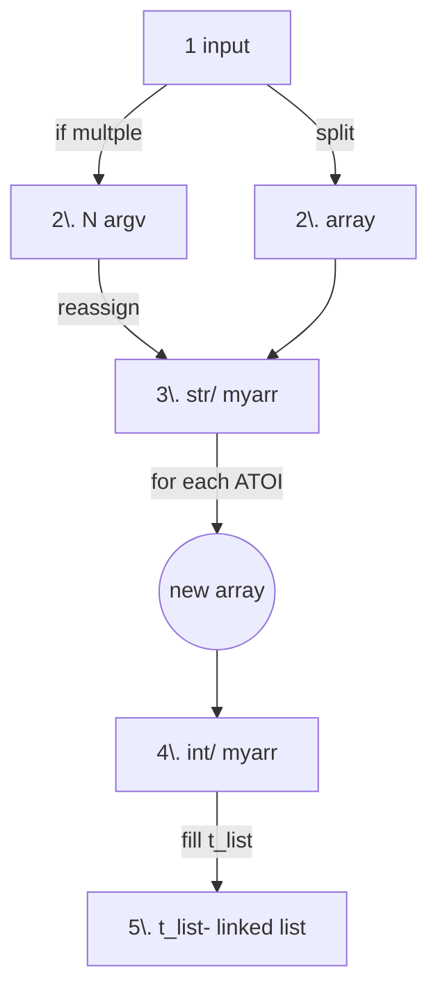

```mermaid 
flowchart TD
1[1 input]-->|if multple|2
1[1 input]-->|split|2.2

2[2\. N argv]--> |reassign|3
2.2[2\. array]--> 3[3\. str/ myarr]

3 -->|for each ATOI| 3.2((new array))
3.2 -->4[4\. int/ myarr]


4-->|fill t_list| 5

5[5\. t_list- linked list]

classDef redNode fill:#c7643a,stroke:#333,stroke-width:2px;
%%class 4,5 redNode


%%note([errors enclude]) .-.n1[one space %%inside string]
%%note([errors enclude]) .-.n2[duplicates]
%%note([errors enclude]) .-.n3[exeeding int %%limit]
%%note([errors enclude]) .-.n4[only - or +]

%%q1([question: is 'space' an error?])
%%q2([question: is '23   44 2' an error?])
class q1,q2 redNode

```